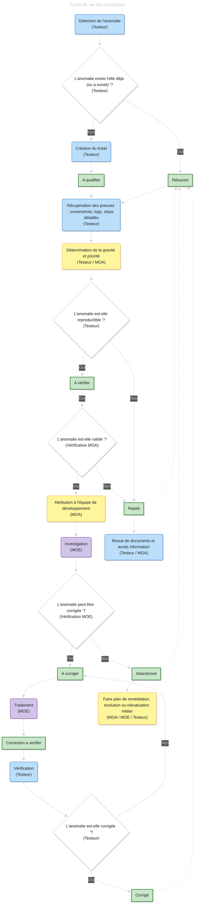

<!-- omit from toc -->

# Gestion des anomalies

- [Diagramme workflow gestion anomalie](#diagramme-workflow-gestion-anomalie)

## Diagramme workflow gestion anomalie

```mermaid
---
config:
  theme: dark
  layout: dagre
  look: neo
title: Cycle de vie des anomalies
---
flowchart TB
    n11@{ label: "L'anomalie existe t'elle déjà (ou a existé) '?<br>(Testeur)" } -- Oui --> n6["Réouvert"]
    A@{ label: "Détection de l'anomalie<br>(Testeur)" } --> n11
    B["Création du ticket<br>(Testeur)"] --> n2["A qualifier"]
    C["Récupération des preuves : screenshots, logs, steps détaillés<br>(Testeur)"] --> D["Détermination de la gravité et priorité<br>(Testeur / MOA)"]
    D --> E["L'anomalie est-elle reproductible '?<br>(Testeur)"]
    G["L'anomalie est-elle valide '?<br>(Vérification MOA)"] -- Non --> F["Rejeté"]
    G -- Oui --> H["Attribution à l'équipe de développement<br>(MOA)"]
    H --> I["Investigation<br>(MOE)"]
    K["Vérification<br>(Testeur)"] --> n1["L'anomalie est-elle corrigée '?<br>(Testeur)"]
    n1 -- Oui --> M["Corrigé"]
    E -- Oui --> n3["A vérifier"]
    n3 -- Oui --> G
    n4["A corriger"] --> J["Traitement<br>(MOE)"]
    I --> n8["L'anomalie peut être corrigée '?<br>(Vérification MOE)"]
    n8 -- Oui --> n4
    n5 -.-> n6
    F --> n9["Revue de documents et accès information<br>(Testeur / MOA)"]
    n11 -- Non --> B
    M -.-> n6
    F -.-> n6
    E -- Non --> F
    n2 --> C
    n6 --> C
    J --> n12["Correction a verifier"]
    n12 --> K
    n5 --> n10["Faire plan de remédiation, évolution ou réévaluation métier<br>(MOA / MOE / Testeur)"]
    n1 -- Non --> n4
    n8 -- Non --> n5["Abandonné"]

    n11@{ shape: diam}
    n6@{ shape: rect}
    A@{ shape: rounded}
    B@{ shape: rounded}
    n2@{ shape: rect}
    C@{ shape: rounded}
    D@{ shape: rounded}
    E@{ shape: diam}
    G@{ shape: diam}
    F@{ shape: rect}
    H@{ shape: rounded}
    I@{ shape: rounded}
    K@{ shape: rounded}
    n1@{ shape: diam}
    M@{ shape: rect}
    n3@{ shape: rect}
    n4@{ shape: rect}
    J@{ shape: rounded}
    n8@{ shape: diam}
    n5@{ shape: rect}
    n9@{ shape: rounded}
    n12@{ shape: rect}
    n10@{ shape: rounded}
     n11:::question
     n6:::etat
     A:::testeur
     B:::testeur
     n2:::etat
     C:::testeur
     D:::moa
     E:::question
     G:::question
     F:::etat
     H:::moa
     I:::etat
     I:::moe
     K:::testeur
     n1:::question
     M:::etat
     n3:::etat
     n4:::etat
     J:::etat
     J:::moe
     n8:::question
     n5:::etat
     n9:::testeur
     n12:::etat
     n10:::moa
    classDef etat fill:#C8E6C9,stroke:#2E7D32,color:#212121,stroke-width:2px
    classDef testeur fill:#BBDEFB,stroke:#1565C0,color:#212121,stroke-width:1px
    classDef moa fill:#FFF59D,stroke:#F9A825,color:#212121,stroke-width:1px
    classDef moe fill:#D1C4E9,stroke:#6A1B9A,color:#212121,stroke-width:1px
    classDef question fill:#FFFFFF,stroke:#9E9E9E,color:#212121,stroke-width:1px,stroke-dasharray:2
```
