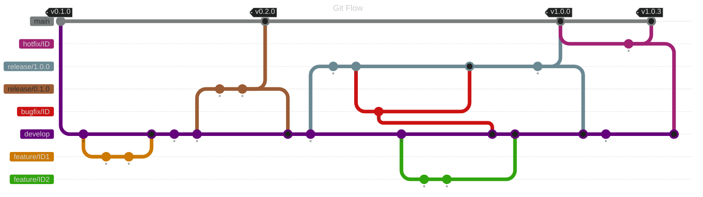

<!-- omit from toc -->
# Documentation GitFlow

- [Présentation de Gitflow](#présentation-de-gitflow)
  - [Branches principales](#branches-principales)
- [Acteurs et responsabilités](#acteurs-et-responsabilités)
  - [Développeur](#développeur)
  - [QA / Automaticien](#qa--automaticien)
  - [Product Owner (PO)](#product-owner-po)
  - [Tech Lead](#tech-lead)
  - [Release Manager](#release-manager)
  - [DevOps](#devops)
  - [Stakeholders Métier](#stakeholders-métier)
- [Workflow type](#workflow-type)
- [Règles de gouvernance](#règles-de-gouvernance)
- [Bénéfices](#bénéfices)
- [Exemple](#exemple)

## Présentation de Gitflow

Gitflow est un modèle de gestion de branches Git permettant de structurer le cycle de vie du développement logiciel.
Il repose sur des branches standardisées pour garantir :

* Une meilleure traçabilité
* Des livraisons sécurisées
* Une collaboration efficace
* Une gestion maîtrisée des correctifs

### Branches principales

| Branche     | Rôle                                       |
| ----------- | ------------------------------------------ |
| `main`      | Code en production                         |
| `develop`   | Version en cours de développement          |
| `feature/*` | Développement de nouvelles fonctionnalités |
| `release/*` | Stabilisation avant livraison              |
| `hotfix/*`  | Correctifs urgents production              |

## Acteurs et responsabilités

### Développeur

**Responsabilités :**

* Créer une branche `feature/*` à partir de `develop`
* Développer la fonctionnalité
* Écrire les tests unitaires
* Maintenir la qualité du code
* Créer une Pull Request vers `develop`
* Corriger les retours de revue

**Bonnes pratiques :**

* Commits atomiques
* Messages normalisés
* Respect des standards qualité
* Pas de commit direct sur `develop` ou `main`

### QA / Automaticien

**Responsabilités :**

* Valider les critères d’acceptation
* Valider les tests unitaires
* Écrire les tests automatisés (API, E2E)
* Mettre à jour la stratégie de test
* Review des Pull Requests
* Valider les pipelines CI
* Identifier les scénarios à automatiser
* Maintenir les tests de régression
* Merger les branches

**Livrables :**

* Tests automatisés
* Rapports de qualité
* KPI couverture
* Documentation QA

### Product Owner (PO)

**Responsabilités :**

* Rédiger les User Stories
* Définir les critères d’acceptation
* Prioriser le backlog
* Participer aux 3 Amigos
* Valider fonctionnellement les features
* Donner le Go/NoGo en recette

### Tech Lead

**Responsabilités :**

* Définir l’architecture
* Valider les choix techniques
* Arbitrer les conflits
* Superviser les revues de code
* Garantir la dette technique maîtrisée
* Valider les merges vers `main`

### Release Manager

**Responsabilités :**

* Créer la branche `release/*`
* Gérer le planning de livraison
* Valider la version
* Coordonner les équipes
* Superviser le déploiement
* Gérer rollback si besoin

### DevOps

**Responsabilités :**

* Maintenir la CI/CD
* Gérer les environnements
* Sécuriser les secrets
* Superviser les déploiements
* Mettre en place monitoring

### Stakeholders Métier

**Responsabilités :**

* Valider la conformité métier
* Participer aux UAT
* Remonter les anomalies
* Donner feedback produit

## Workflow type

1. Création `feature/*`
2. Développement + TU
3. Pull Request vers `develop`
4. Revue Dev + QA
5. Merge dans `develop`
6. Création `release/*`
7. Tests complets
8. Validation PO / Métier
9. Merge vers `main`
10. Tag version
11. Déploiement production

## Règles de gouvernance

* Pas de commit direct sur `main`
* Revue obligatoire
* Pipeline CI obligatoire
* Tests requis OK + Go / NoGo (KPI)
* Convention de nommage
* Branches nettoyées

## Bénéfices

* Traçabilité
* Qualité continue
* Sécurité des livraisons
* Collaboration efficace
* Rollback facilité

## Exemple

