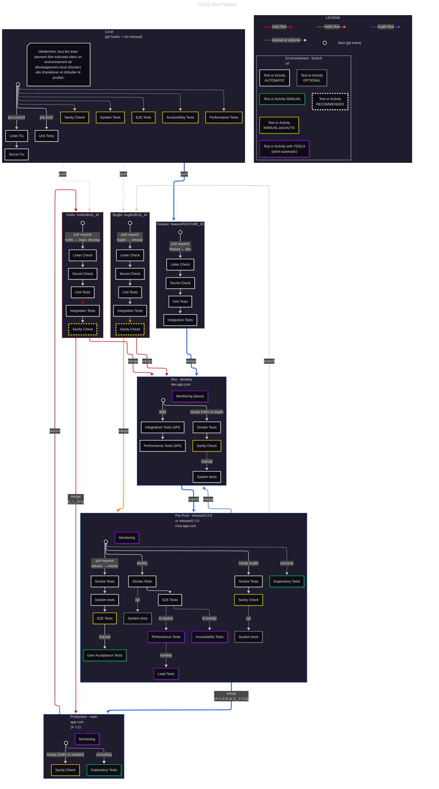

<!-- omit from toc -->

# Pipeline

- [Pipeline complet (à implémenter)](#pipeline-complet-à-implémenter)

## Pipeline complet (à implémenter)

```mermaid
---
config:
  theme: redux-dark
  layout: elk
  look: neo
title: CI/CD Test Pipeline
---
flowchart TB
 subgraph ENV["Environnement : branch<br>url"]
    direction TB
        n3["Test or Activity <br> MANUAL and AUTO"]
        n4["Test or Activity with TOOLS <br> (semi-automatic)"]
        n5["Test or Activity MANUAL"]
        n6["Test or Activity<br>AUTOMATIC"]
        n15["Test or Activity<br>OPTIONAL"]
        n16["Test or Activity<br>RECOMMENDED"]
  end
 subgraph LEGEND["LEGEND"]
    direction LR
        n1["Small start"]
        n2["Start (git event)"]
        n7[" "]
        n8[" "]
        n9[" "]
        n10[" "]
        n11[" "]
        n12[" "]
        n13[" "]
        n14[" "]
        ENV
  end
 subgraph LOCAL["Local<br>(git hooks + run manual)"]
    direction TB
        SL["Small start"]
        L1["Linter Fix"]
        L2["Secret Fix"]
        L3["Unit Tests"]
        L4["System Tests"]
        L5["E2E Tests"]
        L6["Performance Tests"]
        L7["Sanity Check"]
        L8["Accessibility Tests"]
        A1@{ label: "Idéalement, tous les tests peuvent être exécutés dans un environnement de développement local (Docker) afin d'améliorer et d'étudier le produit." }
  end
 subgraph FEATURE["Feature: feature/FEATURE_ID"]
    direction TB
        SF["Small start"]
        F1["Linter Check"]
        F2["Secret Check"]
        F3["Unit Tests"]
        F4["Integration Tests"]
  end
 subgraph BUGFIX["Bugfix: bugfix/BUG_ID"]
    direction TB
        SB["Small start"]
        B1["Linter Check"]
        B2["Secret Check"]
        B3["Unit Tests"]
        B4["Sanity Check"]
        B5["Integration Tests"]
  end
 subgraph HOTFIX["Hotfix: hotfix/BUG_ID"]
    direction TB
        SH["Small start"]
        H1["Linter Check"]
        H2["Secret Check"]
        H3["Unit Tests"]
        H5["Sanity Check"]
        H6["Integration Tests"]
  end
 subgraph PUSH[" "]
    direction LR
        FEATURE
        HOTFIX
        BUGFIX
  end
 subgraph DEV["Dev : develop<br>dev.app.com"]
    direction TB
        SD["Small start"]
        D0["Monitoring (down)"]
        D1["Integrationt Tests  (API)"]
        D6["Performance Tests (API)"]
        D8["Smoke Tests"]
        D9["System tests"]
        D7["Sanity Check"]
  end
 subgraph PREPROD["Pre-Prod : release/X.0.0<br>or release/0.Y.0<br>moa.app.com"]
    direction TB
        SR["Small start"]
        R0["Monitoring"]
        R12["System tests"]
        R13["System tests"]
        R1["E2E Tests"]
        R11["E2E Tests"]
        R2["User Acceptance Tests"]
        R4["Smoke Tests"]
        R10["Smoke Tests"]
        R6["Performance Tests"]
        R7["Load Tests"]
        R8["Accessibility Tests"]
        R9["Sanity Check"]
        R14["Exploratory Tests"]
        R15["System tests"]
        R16["Smoke Tests"]
  end
 subgraph PROD["Production : main<br>app.com<br>(X.Y.Z)"]
    direction TB
        SM["Small start"]
        M1["Sanity Check"]
        M2["Monitoring"]
        M3["Exploratory Tests"]
  end
    DEV ~~~ FEATURE & PREPROD
    FEATURE ~~~ DEV
    PREPROD ~~~ PROD
    SL -- pre commit --> L1
    SL -- pre push --> L3
    L1 --> L2
    SL -.-> L7 & L4 & L5 & L8 & L6
    LOCAL == push ==> FEATURE
    SF -- pull request<br>feature → dev --> F1
    F1 --> F2
    F2 --> F3
    F3 --> F4
    FEATURE == merge ==> DEV
    SD -- daily --> D1
    D1 --> D6
    DEV == branch ==> PREPROD
    SR -- pull request<br>release → master --> R4
    SR -- weekly --> R10
    R6 -. monthly .-> R7
    R10 -. opt .-> R12
    R10 --> R1
    R4 --> R13
    R11 -- manual --> R2
    R1 -. "bi-weekly" .-> R6 & R8
    PREPROD -- merge --> DEV
    PREPROD == "merge <br> (X+1.0.0) or (\_.Y+1.0)" ==> PROD
    SM -- merge (hotfix or release) --> M1
    SM -. consulting .-> M3
    PREPROD -- branch --------> BUGFIX
    SB -- pull request<br>bugfix → release --> B1
    B1 --> B2
    B2 --> B3
    B3 --> B5
    B5 --> B4
    BUGFIX -- merge --> PREPROD & DEV
    PROD -- branch --------> HOTFIX
    SH -- pull request<br>hotfix → main, develop --> H1
    H1 --> H2
    H2 --> H3
    H3 --> H6
    HOTFIX -- merge --> DEV
    HOTFIX -- "merge <br> (\_.\_.Z+1)" --> PROD
    LOCAL -. push .-> HOTFIX & BUGFIX
    SR -- merge bugfix --> R16
    SR -. ponctual .-> R14
    H6 --> H5
    SD -- merge hotfix or bugfix --> D8
    D8 --> D7
    D7 -. manual .-> D9
    R16 --> R9
    R13 --> R11
    R9 -. opt .-> R15
    n1 ~~~ n2
    n7 == main flow ==> n8
    n9 -- hotfix flow --> n10
    n11 -- bugfix flow --> n12
    n13 -. manual or optional .-> n14
    n0["n0"]

    n1@{ shape: sm-circ}
    SL@{ shape: sm-circ}
    A1@{ shape: card}
    SF@{ shape: sm-circ}
    SB@{ shape: sm-circ}
    SH@{ shape: sm-circ}
    SD@{ shape: sm-circ}
    SR@{ shape: sm-circ}
    R2@{ shape: rect}
    SM@{ shape: sm-circ}
     n3:::AUTO_AND_MANUAL
     n4:::TOOL
     n5:::MANUAL
     n6:::AUTO
     n15:::OPT
     n16:::OPT
     n7:::INVISIBLE
     n8:::INVISIBLE
     n9:::INVISIBLE
     n10:::INVISIBLE
     n11:::INVISIBLE
     n12:::INVISIBLE
     n13:::INVISIBLE
     n14:::INVISIBLE
     L4:::AUTO_AND_MANUAL
     L5:::AUTO_AND_MANUAL
     L6:::AUTO_AND_MANUAL
     L7:::AUTO_AND_MANUAL
     L8:::AUTO_AND_MANUAL
     B4:::AUTO_AND_MANUAL
     H5:::AUTO_AND_MANUAL
     D0:::TOOL
     D7:::AUTO_AND_MANUAL
     R0:::TOOL
     R12:::OPT
     R11:::AUTO_AND_MANUAL
     R2:::MANUAL
     R6:::TOOL
     R7:::TOOL
     R8:::TOOL
     R9:::AUTO_AND_MANUAL
     R14:::MANUAL
     R15:::OPT
     M1:::AUTO_AND_MANUAL
     M2:::TOOL
     M3:::MANUAL
     n0:::INVISIBLE
    classDef TOOL stroke-width:2px, stroke-dasharray:0, stroke:#AA00FF
    classDef AUTO_AND_MANUAL stroke-width:2px, stroke-dasharray:0, stroke:#FFD600
    classDef MANUAL stroke-width:2px, stroke-dasharray:0, stroke:#00C853
    classDef INVISIBLE stroke:transparent, fill:transparent, color:transparent
    classDef AUTO stroke-width:2px, stroke-dasharray:0, stroke:#FFFFFF
    classDef OPT stroke-width:2px, stroke-dasharray:2
    style n16 stroke-width:4px,stroke-dasharray: 5
    style n2 stroke:none,fill:transparent
    style B4 stroke-width:4px,stroke-dasharray: 5
    style H5 stroke-width:4px,stroke-dasharray: 5
    style HOTFIX stroke:#D50000
    style BUGFIX stroke:#FF6D00
    style D9 stroke-width:2px,stroke-dasharray: 0
    style R12 stroke-width:2px,stroke-dasharray: 2
    style R13 stroke-width:2px,stroke-dasharray: 0
    style R15 stroke-width:2px,stroke-dasharray: 2
    style DEV stroke:#2962FF
    style PREPROD stroke:#2962FF
    style PROD stroke:#2962FF
    style PUSH fill:transparent,stroke:none
    linkStyle 12 stroke:#2962FF,fill:none
    linkStyle 17 stroke:#2962FF,fill:none
    linkStyle 20 stroke:#2962FF,fill:none
    linkStyle 30 stroke:#2962FF,fill:none
    linkStyle 31 stroke:#2962FF,fill:none
    linkStyle 33 stroke:#FFFFFF,fill:none
    linkStyle 39 stroke:#FF6D00,fill:none
    linkStyle 40 stroke:#FF6D00,fill:none
    linkStyle 41 stroke:#D50000,fill:none
    linkStyle 42 stroke:#D50000,fill:none
    linkStyle 46 stroke:#D50000,fill:none
    linkStyle 47 stroke:#D50000,fill:none
    linkStyle 48 stroke:#D50000,fill:none
    linkStyle 60 stroke:#2962FF,fill:none
    linkStyle 61 stroke:#D50000,fill:none
    linkStyle 62 stroke:#FF6D00,fill:none
    linkStyle 63 stroke:#2962FF,fill:none
```
