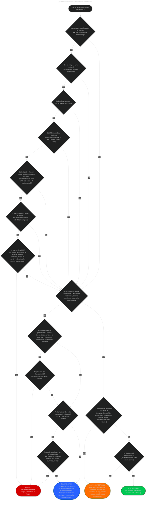

# Quand un teste doit être automatisé ?

- [Diagramme décision](#diagramme-décision)

## Diagramme décision

```mermaid
---
config:
  theme: dark
  layout: dagre
  look: neo
title: Déterminer si un test web doit être automatisé
---
flowchart TB
 subgraph s1["Quoi faire ?"]
    direction LR
        Manuel(["MANUEL<br>(ex: test exploratoire unique, vérification de bugs)"])
        Outiller(["MANUEL AVEC OUTILS/SPÉCIFIQUES<br>(ex: outils cybersécurité, outils acessibilités, développement interne, framework personnalisé, scripts oneshot)"])
        Reporter(["À AUTOMATISER PLUS TARD (fonctionnalité non stabilisée, en cours de correction de bug, feature avec des problèmes de performance)"])
        Automatise(["AUTOMATIQUE<br>(ex: unitaires, intégration, scénario e2e critiques)"])
  end
    Start(["Est ce que le test doit être automatisé ?"]) --> GainTemps@{ label: "Automatiser ferait-il gagner du temps ?<br>(ex: temps d'exécution manuel long)" }
    Stable@{ label: "La fonctionnalité testée est-elle stable ?<br>(ex: page d'accueil de longue date, test manuels déjà fait dessus, fonctionnalité sans évolution)" } -- Non --> Reporter
    Souvent{"Est-il exécuté souvent ?<br>(ex: tous les builds CI/CD)"} -- Non --> MultiPlat{"Doit-il être validé sur plusieurs plateformes/navigateurs ?<br>(ex: Chrome, Firefox, Safari)"}
    MultiPlat -- Non --> Datas{"Le test porte-t-il sur un grand nombre de jeux de données ?<br>(ex: calculs fiscaux sur 1000 cas, gestion de stocks massifs)"}
    Complexe@{ label: "Est ce qu'il est compliqué à automatiser ? (besoin de ressources, analyse complexe, récupération des données)" } -- Oui --> Perf@{ label: "S'agit-il d'un test de performance / charge?<br>(ex: accés concurrent à la page login, stress test, mesure des performances critiques)" }
    GainTemps -- Non --> Critique{"Est-ce critique pour le métier ?<br>(ex: paiement en ligne, commande)"}
    Deterministic{"Le résultat est-il déterministe ?<br>(ex: même résultat pour même entrée)"} -- Non --> Reporter
    Critique -- Non --> Souvent
    Datas -- Non --> Humain@{ label: "Le test est-il sujet à l'erreur humaine ?<br>(ex: vérification visuelle, calculations longues)" }
    Complexe -- Non --> Stable
    Deterministic -- Oui --> Automatise
    OutilsA11y{"Peut-on utiliser des outils automatisés existants ?<br>(ex: Axe, Lighthouse, JMeter)"} -- Non --> OutilsSpeciaux{"Des outils spécifiques sont-ils nécessaires<br>(ex: parsing PDF, mocks avancés, API privées, CAPTCHA, OCR) ?"}
    Humain -- Non --> Repetitif{"Le test est-il répétitif ?<br>(ex: vérifier la présence de champs dans un formulaire, refaire de manière mécanique les mêmes actions, login )"}
    Humain -- Oui --> Complexe
    GainTemps -- Oui --> Complexe
    Critique -- Oui --> Complexe
    Souvent -- Oui --> Complexe
    MultiPlat -- Oui --> Complexe
    Datas -- Oui --> Complexe
    Stable -- Oui --> Deterministic
    Perf -- Non --> A11yTest@{ label: "S'agit-il d'un test d'accessibilité ?<br>(ex: contraste, navigation clavier)" }
    A11yTest -- Non --> Manuel
    Repetitif -- Non --> Manuel
    Repetitif -- Oui --> Complexe
    Perf -- Oui --> OutilsA11y
    A11yTest -- Oui --> OutilsA11y
    OutilsSpeciaux -- Non --> Manuel
    OutilsSpeciaux -- Oui --> Outiller
    OutilsA11y -- Oui --> Outiller

    GainTemps@{ shape: diamond}
    Stable@{ shape: diamond}
    Complexe@{ shape: decision}
    Perf@{ shape: diam}
    Humain@{ shape: diamond}
    A11yTest@{ shape: diamond}
     Manuel:::manuel
     Outiller:::outiller
     Reporter:::reporter
     Automatise:::auto
    classDef auto fill:#87d68d,stroke:#336633,stroke-width:2px
    classDef manuel fill:#eaa,stroke:#a33,stroke-width:2px
    classDef reporter fill:#ffe066,stroke:#887711,stroke-width:2px
    classDef outiller fill:#6dd5f5,stroke:#005596,stroke-width:2px
    classDef outiller_spec fill:#00babc,stroke:#005596,stroke-width:2px
    style Manuel color:#FFFFFF,fill:#D50000
    style Outiller fill:#2962FF
    style Reporter fill:#FF6D00
    style Automatise fill:#00C853
    style s1 stroke:none,fill:transparent
```
