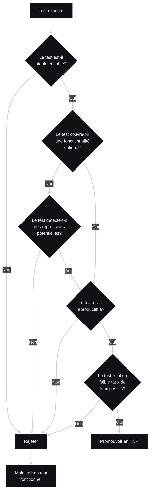

<!-- omit from toc -->

# Gestion TNR

- [Diagramme TNR](#diagramme-tnr)

## Diagramme TNR

```mermaid
---
config:
  theme: redux-dark
---
flowchart TD
    A[Test exécuté] --> B{Le test est-il<br/>stable et fiable?}
    B -->|Non| C[Rejeter]
    B -->|Oui| D{Le test couvre-t-il<br/>une fonctionnalité<br/>critique?}
    D -->|Non| E{Le test détecte-t-il<br/>des régressions<br/>potentielles?}
    D -->|Oui| F{Le test est-il<br/>reproductible?}
    E -->|Non| C
    E -->|Oui| F
    F -->|Non| C
    F -->|Oui| G{Le test a-t-il un<br/>faible taux de<br/>faux positifs?}
    G -->|Non| C
    G -->|Oui| H[Promouvoir en TNR]
    C --> I[Maintenir en test<br/>fonctionnel]
```
